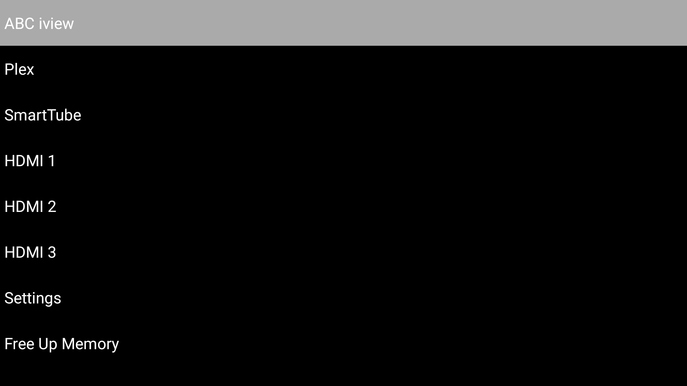

# Lemon Launcher

The smallest, plainest Android TV home screen that could work: a black
screen, a text list of the apps/inputs you pick, nothing else.



- **16.9KB APK**, no libraries, no AndroidX, no Kotlin runtime
- Zero background components — nothing runs unless you're looking at it
- Text-only, no icons to load or decode
- Works from Android 5.0 (API 21) up
- Built with raw Android SDK command-line tools — no Gradle, no Android Studio

## Download

Grab the signed APK from [Releases](https://github.com/datapush3r/lemon-launcher/releases) —
no build tools needed, just sideload it:

```sh
adb connect <tv-ip>:5555
adb install -r lemonlauncher.apk
```

Every release is built and signed by [GitHub Actions](.github/workflows/release.yml)
straight from this source, with one dedicated signing key reused across
versions — releases upgrade in place instead of requiring a reinstall.

## Using it

- **Short press** an item to launch it
- **Long press** anywhere to open the add/remove picker — lists every
  installed app, TV input (HDMI, etc.), and a couple of built-in actions
  (Settings, Free Up Memory). Press an item to toggle it on/off your
  home list. Long press again to exit the picker.
- First run starts blank — long press to add your first items.

## Performance

Measured on the actual test device (TCL "Smart TV Pro", Android 11 /
API 30) via `adb shell dumpsys meminfo`, `top`, and `am start -W`.

| Metric | Result |
|---|---|
| APK size | 16.9 KB |
| `classes.dex` | 10.2 KB (2 compiled classes) |
| Installed (code) size on device | 25 KB |
| Cold start (`am start -W`, process not running) | 477 ms |
| Warm resume (process cached, pressing Home) | 85 ms |
| Foreground memory, settled | **11.6 MB PSS** / 4.0 MB Private Dirty |
| CPU while idle on screen | **0.0%** |
| CPU while backgrounded/cached | **0.0%** |
| Background components | **0** — no services, receivers, or providers |

**What "0 MB when backgrounded" actually means:** Android keeps a
recently-used app's process cached in RAM after you leave it, for fast
return — this is normal OS behavior, true of every app, not something
we opt into or out of. What we control is what's *in* that process: no
services, no receivers, no timers, no threads. Confirmed via
`dumpsys activity processes` — while backgrounded the process sits in
the `LAST`/cached state doing nothing, 0.0% CPU, and it's reclaimed
first (lowest priority in the OS's kill order) the instant the system
needs the RAM back. It costs the device nothing while it's not in use.

Reproduce it yourself:

```sh
adb shell dumpsys meminfo io.github.datapush3r.lemonlauncher
adb shell top -n 1 -b | grep lemonlauncher
adb shell am start -W -n io.github.datapush3r.lemonlauncher/.TvLauncherActivity
```

## Building

Requires the Android SDK command-line tools (`sdkmanager`, `aapt2`,
`d8`, `apksigner`, `zipalign` — installable via `brew install --cask
android-commandlinetools` on macOS) and a JDK. No Gradle involved.

```sh
./build.sh
```

Produces `out/lemonlauncher.apk`.

## Installing

```sh
adb connect <tv-ip>:5555
adb install -r out/lemonlauncher.apk
adb shell cmd package set-home-activity io.github.datapush3r.lemonlauncher/.TvLauncherActivity
```

Then, on the TV, open the app's **App info** screen and tap **Clear
defaults** once, press Home, and choose Lemon Launcher as your default
launcher — that's the one durable way to set it (a normal app has no API
to force itself as the default home app).

## Releasing

Push a `v*` tag and CI builds, signs, and publishes it:

```sh
git tag v1.1
git push origin v1.1
```

## F-Droid

MIT-licensed and buildable offline from source with no network access
during the build — the two hard requirements for F-Droid inclusion. A
[`.fdroid.yml`](.fdroid.yml) build recipe is included at the repo root.
